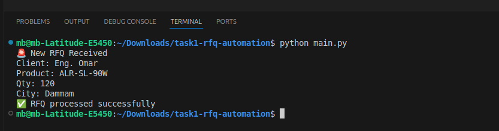
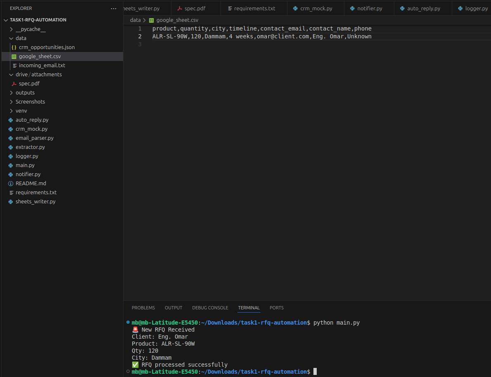
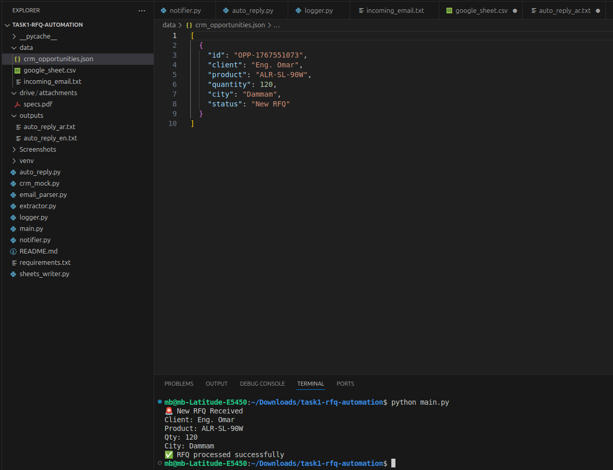
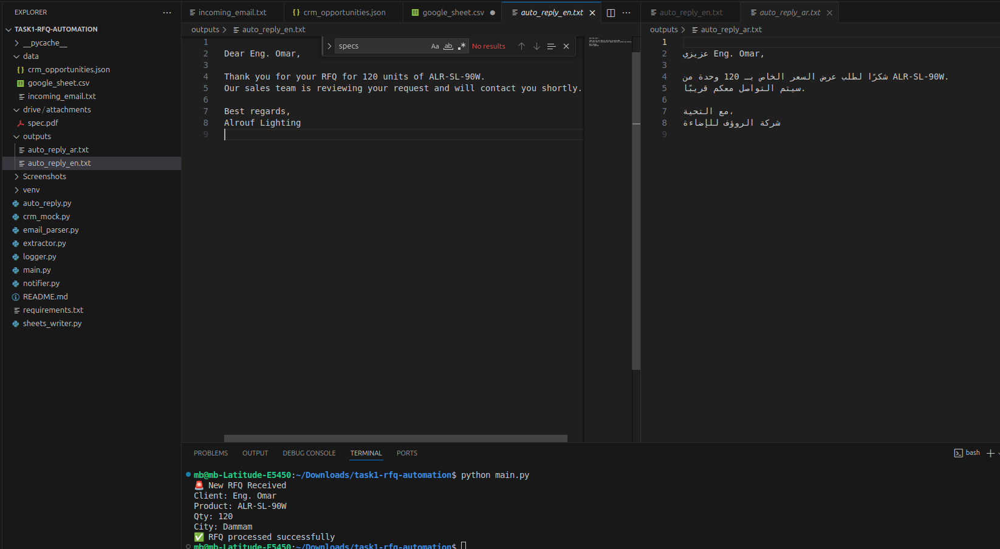

# Task 1 — RFQ → CRM Automation (No‑Code + LLM optional)

## Description
This project automates how RFQ (Request for Quotation) emails are handled. Instead of reading emails manually, the system picks up incoming RFQ emails, understands what the customer is asking for, and pulls out important details like the product, quantity, delivery location, timeline, and contact information.

After extracting the details, the system saves them in a Google Sheets–style CSV and also creates an Opportunity in a Salesforce-like mock CRM. Any attached files, such as product specifications, are stored safely in a Drive-style folder. The customer then receives an automatic reply in English or Arabic, and the internal team is notified through a Slack or Teams-style alert.

Overall, this automation helps the sales team respond faster, avoid missing details, and handle RFQs in a more organized and reliable way.

---

## Project Objective
To automatically read incoming RFQ emails, extract structured information, store it in a CRM-like system and Google Sheet–style CSV, generate bilingual auto-replies (English & Arabic), and notify internal teams.

---

## Data Set Story
The system uses mock data sources to simulate real-world workflows:
- Incoming RFQ emails are stored as text files.
- Extracted RFQ details are saved in CSV format (Google Sheet mimic).
- CRM opportunities are stored in JSON format.
- Email attachments are handled from a local directory.


## Setup

### Install Python 3.10+ 

### Create and activate a virtual environment:

```bash
python -m venv venv
source venv/bin/activate      # Linux/Mac
venv\Scripts\activate         # Windows 
```
### Install dependencies:
```bash
pip install -r requirements.txt
```

### Place incoming emails under data folder (data/incoming_email.txt).

### Run the main script:
```bash
python main.py
```
### Outputs:
Generates automatic reply messages in English (`auto_reply_en.txt`) and Arabic (`auto_reply_ar.txt`) under output folder.


    
## Deliverables
### Scenario Blueprint / Screenshots: 
console output of RFQ from Eng. Omar.



### Sample Sheet + Drive Folder: 
google_sheet.csv simulates the Google Sheet storing RFQ details, and data/drive/attachments/ contains archived attachments like specs.pdf.




### CRM Mock Log (JSON): 
crm_opportunities.json contains the recorded Opportunities with extracted fields from incoming RFQs, simulating a Salesforce CRM.



### Auto-reply Sample:
Generated auto-reply messages in English (outputs/auto_reply_en.txt) and Arabic (outputs/auto_reply_ar.txt).




